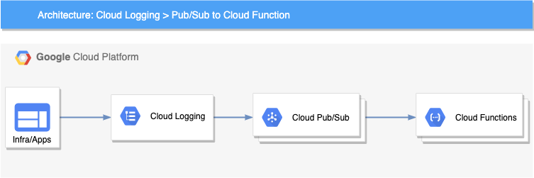

## Demo code for real-time logging processing

This sample code helps get you started with real-time log proccessing in Google Cloud.

### Introduction

Google Cloud logging tools are built to help you find and understand your logs. You may have business or technical processes that may require an automated action or you may want to reduce [toil](https://landing.google.com/sre/sre-book/chapters/eliminating-toil/) for your DevOps team. For example, you may want to use changes in your [Cloud Audit Logs](https://cloud.google.com/logging/docs/audit) to take action and remediate a security vulnerability caused by inadvertent infrastructure changes.

Using a [Logging sink](https://cloud.google.com/logging/docs/export), you can build an event-driven system to detect and respond to log events in real time. Cloud Logging can help you to build this event-driven architecture through its [integration](https://cloud.google.com/logging/docs/export/using_exported_logs#pubsub-overview) with [Cloud Pub/Sub](https://cloud.google.com/pubsub) and a serverless computing service such as [Cloud Functions](https://cloud.google.com/functions) or [Cloud Run](https://cloud.google.com/run).

### Architecture overview

The high-level architecture of this event-driven system is both simple and flexible. There are four main components:

+   **Log events** – The applications and the infrastructure send logs to Cloud Logging
+   **Logging** – Cloud Logging sinks in the [Logs Router](https://cloud.google.com/logging/docs/routing/overview) lets you send log events to Pub/Sub topics based on the specific filters you create
+   **Pub/Sub** - Initiates Cloud Functions asynchronously based on the received log events
+   **Cloud Functions**  – The business logic to process and respond to the log events

What's Here
-----------

This repo includes:

* README.md - this file
* firewall-demo - Demo code for a firewall change captured in the log
* gcs-demo - Demo code for a storage bucket change captured in the activity log
* product-metric-demo - Based on a [sample micro-services app](https://github.com/GoogleCloudPlatform/microservices-demo), the demo code will extract recommended products and create custom metrics
* log-message-metric-demo - Demo code to create a metric based on the translations of application messages captured in the log
* trace-metric-demo - Demo code to capture multiple related log messages and calculate time difference for a metric
* dm - Supporting code for Deployment Manager

### License

Apache 2.0 - See [LICENSE](LICENSE) for more information.