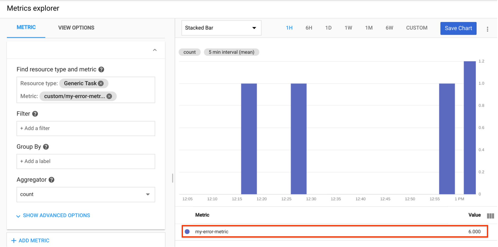

### Overview
In this example, we try to filter the log events and extract text messages from the payloads. We send the text messages to the Google translation service for translation. If a translation result has the phrase we are searching for, we send a custom metric to the monitoring service.

Please review the code for details.

You can follow the instructions below in your cloud shell to test it.

### Enable needed service APIs:

```bash
# Enable the Deployment Manager API if it's not enabled:
  gcloud services enable deploymentmanager.googleapis.com

# Enable pubsub API:
  gcloud services enable pubsub.googleapis.com

# Enable Cloud Build API:
  gcloud services enable cloudbuild.googleapis.com

# Enable Resource Manager API:
  gcloud services enable cloudresourcemanager.googleapis.com

# Enable Cloud Functions API:
  gcloud services enable cloudfunctions.googleapis.com

# Enable translate service API:
  gcloud services enable translate.googleapis.com
```

### Grant permissions to service accounts

```bash
  PROJECT=$(gcloud config get-value project)
  PROJECT_NUMBER=$(gcloud projects list --filter="PROJECT_ID=$PROJECT" --format="value(PROJECT_NUMBER)")
  # grant owner role to deployment manager
  gcloud projects add-iam-policy-binding $PROJECT --member serviceAccount:${PROJECT_NUMBER}@cloudservices.gserviceaccount.com --role roles/owner
  # grant invoker role to service account
  gcloud projects add-iam-policy-binding $PROJECT --member serviceAccount:${PROJECT}@appspot.gserviceaccount.com --role roles/cloudfunctions.invoker
  # grant secret accessor role to service account
  gcloud projects add-iam-policy-binding $PROJECT --member serviceAccount:${PROJECT}@appspot.gserviceaccount.com --role roles/secretmanager.secretAccessor
  # grant translation user role to service account
  gcloud projects add-iam-policy-binding $PROJECT --member serviceAccount:${PROJECT}@appspot.gserviceaccount.com --role roles/cloudtranslate.user
```

### Deploy the cloud function:

```bash
# set project id in the config file
sed -e "s/REPLACE_ME_PROJECT_ID/$PROJECT/" logging_func.yaml > metric_logging_func.yaml
# deploy
gcloud deployment-manager deployments create metric-log-demo --config metric_logging_func.yaml
```
Alternatively, you can use [Terraform](https://www.terraform.io/) to deploy the function. The `main.tf` file is a Terraform configuration example you can use.

### Verify the result

First we need send some log messages, for example:

```bash
gcloud logging write my-error-log "A simple entry with execution error!"

gcloud logging write my-error-log '{"message": "My second Execution Error"}' --payload-type=json

# Japanese error message
gcloud logging write my-error-log '{"message": "My JP message 実行エラー."}' --payload-type=json

# Chinese error message
gcloud logging write my-error-log "文件执行错误!"

```

For each filtered log message which has our _search phrase_, it will trigger our cloud function and create a custom metric.
We can create a chart in cloud monitoring and view the result, for example:


