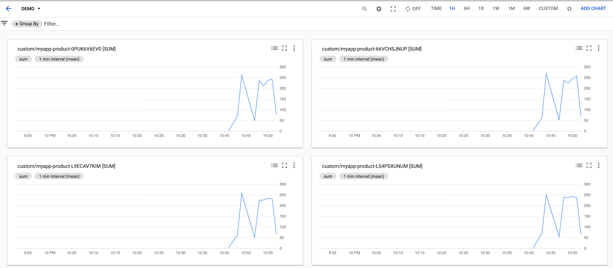

### Overview

This example is based on a [demo eCommerce app](https://github.com/GoogleCloudPlatform/microservices-demo). You need to create a GKE cluster and deploy the app before you can try the demo code.

In this example, we try to filter the log events and extract the recommended products. For demo purposes, we will create an individual custom metric for each recommended product. Optionally, you can also save the data into [Cloud Firestore](https://cloud.google.com/firestore). 

Please review the code for details.

After you have the demo app up and running, you can follow the instructions below in your cloud shell to test it.

### Enable needed service APIs:

```bash
# Enable the Deployment Manager API if it's not enabled:
  gcloud services enable deploymentmanager.googleapis.com

# Enable pubsub API:
  gcloud services enable pubsub.googleapis.com

# Enable Cloud Build API:
  gcloud services enable cloudbuild.googleapis.com

# Enable Resource Manager API:
  gcloud services enable cloudresourcemanager.googleapis.com

# Enable Cloud Functions API:
  gcloud services enable cloudfunctions.googleapis.com

# Enable Firestore service API:
  gcloud services enable firestore.googleapis.com
```

### Grant permissions to service accounts

```bash
  PROJECT=$(gcloud config get-value project)
  PROJECT_NUMBER=$(gcloud projects list --filter="PROJECT_ID=$PROJECT" --format="value(PROJECT_NUMBER)")
  # grant owner role to deployment manager
  gcloud projects add-iam-policy-binding $PROJECT --member serviceAccount:${PROJECT_NUMBER}@cloudservices.gserviceaccount.com --role roles/owner
  # grant invoker role to service account
  gcloud projects add-iam-policy-binding $PROJECT --member serviceAccount:${PROJECT}@appspot.gserviceaccount.com --role roles/cloudfunctions.invoker
  # grant secret accessor role to service account
  gcloud projects add-iam-policy-binding $PROJECT --member serviceAccount:${PROJECT}@appspot.gserviceaccount.com --role roles/secretmanager.secretAccessor
  # grant firestore user role to service account
  gcloud projects add-iam-policy-binding $PROJECT --member serviceAccount:${PROJECT}@appspot.gserviceaccount.com --role roles/datastore.user
```
### Create a Firestore database:

If you don't have a Firestore database, you need go to [the Firestore console](https://console.cloud.google.com/firestore) and create a native database.

### Deploy the cloud function:

```bash
# set project id in the config file
sed -e "s/REPLACE_ME_PROJECT_ID/$PROJECT/" logging_func.yaml > metric_logging_func.yaml
# deploy
gcloud deployment-manager deployments create metric-log-demo --config metric_logging_func.yaml
```
Alternatively, you can use [Terraform](https://www.terraform.io/) to deploy the function. The `main.tf` file is a Terraform configuration example you can use.

### Verify the result

The load generator deployed should send traffic to the web application and generate metric data. However, if that doesn't happen, you can open the app and click the products and trigger the log processing.

Any log messages match the following filter will be sent to Pub/Sub and processed by the Cloud Function.

`labels."k8s-pod/app"="recommendationservice" AND jsonPayload.message:"[Recv ListRecommendations] product_ids="`


When we have enough data points, we can create a chart in cloud monitoring and view the result, for example:




If you want to save the data in Firestore, you can set the environment variable IS_SAVE_TO_FIRESTORE to true and redeploy the function. You should be able to see the data updated in Firestore in real-time. 

You could also use the following command to run the `display_update.py` script, which provides real-time updates of the Firestore database too.

```bash
python3 -mvenv /tmp/venv
source /tmp/venv/bin/activate
pip install -r function_src/requirements.txt 
python ./display_update.py
```