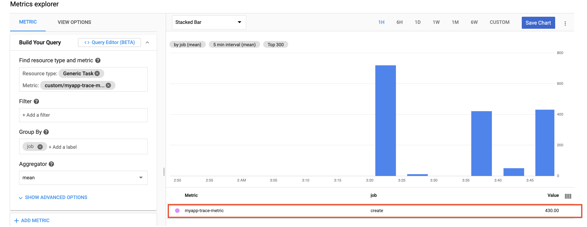

### Overview
In this example, we try to filter the log events and extract timestamp and order of the operations. We will save the data into [Cloud Firestore](https://cloud.google.com/firestore). Based on the start and end time, we will calculate the elapsed time for an async operation.

In our example, we use the boolean field `first` and `last` to indicate the start and end of our operation. We also need a few more fields such as timestamp to generate the custom metric. For example:

```json
{
   "id":"1234567",
   "producer":"My app",
   "methodName":"create",
   "timestamp":"2020-06-01T14:32:15.167Z",   
   "first":true
   ......
}
```

Please review the code for details.

You can follow the instructions below in your cloud shell to test it.

### Enable needed service APIs:

```bash
# Enable the Deployment Manager API if it's not enabled:
  gcloud services enable deploymentmanager.googleapis.com

# Enable pubsub API:
  gcloud services enable pubsub.googleapis.com

# Enable Cloud Build API:
  gcloud services enable cloudbuild.googleapis.com

# Enable Resource Manager API:
  gcloud services enable cloudresourcemanager.googleapis.com

# Enable Cloud Functions API:
  gcloud services enable cloudfunctions.googleapis.com

# Enable translate service API:
  gcloud services enable firestore.googleapis.com
```

### Grant permissions to service accounts

```bash
  PROJECT=$(gcloud config get-value project)
  PROJECT_NUMBER=$(gcloud projects list --filter="PROJECT_ID=$PROJECT" --format="value(PROJECT_NUMBER)")
  # grant owner role to deployment manager
  gcloud projects add-iam-policy-binding $PROJECT --member serviceAccount:${PROJECT_NUMBER}@cloudservices.gserviceaccount.com --role roles/owner
  # grant invoker role to service account
  gcloud projects add-iam-policy-binding $PROJECT --member serviceAccount:${PROJECT}@appspot.gserviceaccount.com --role roles/cloudfunctions.invoker
  # grant secret accessor role to service account
  gcloud projects add-iam-policy-binding $PROJECT --member serviceAccount:${PROJECT}@appspot.gserviceaccount.com --role roles/secretmanager.secretAccessor
  # grant translation user role to service account
  gcloud projects add-iam-policy-binding $PROJECT --member serviceAccount:${PROJECT}@appspot.gserviceaccount.com --role roles/datastore.user
```
### Create a Firestore database:

If you don't have a Firestore database, you need go to [the Firestore console](https://console.cloud.google.com/firestore) and create a native database.

### Deploy the cloud function:

```bash
# set project id in the config file
sed -e "s/REPLACE_ME_PROJECT_ID/$PROJECT/" logging_func.yaml > metric_logging_func.yaml
# deploy
gcloud deployment-manager deployments create metric-log-demo --config metric_logging_func.yaml
```
Alternatively, you can use [Terraform](https://www.terraform.io/) to deploy the function. The `main.tf` file is a Terraform configuration example you can use.

### Verify the result

First we need send a log message to indicate the operation starts by setting the `first` field as true, for example:

```bash
gcloud logging write my-trace-log '{"producer": "My app", "methodName": "create", "timestamp": "2020-06-01T14:32:15.167Z", "id": "1234567", "first": true}' --payload-type=json
```

Then we will send a log message to indicate the operation completes by setting the `last` field as true(notice the different timestamps), for example:
```bash
gcloud logging write my-trace-log '{"producer": "My app", "methodName": "create", "timestamp": "2020-06-01T14:32:25.167Z", "id": "1234567", "last": true}' --payload-type=json

```

For the filtered log messages which has our _log name_, it will trigger our cloud function and create an entry in firestore. If the data entry has both `first` and `last` fields set as true, we will calculate the time difference and send it as a custom metric to cloud monitoring.


When we have enough data points, we can create a chart in cloud monitoring and view the result, for example:


